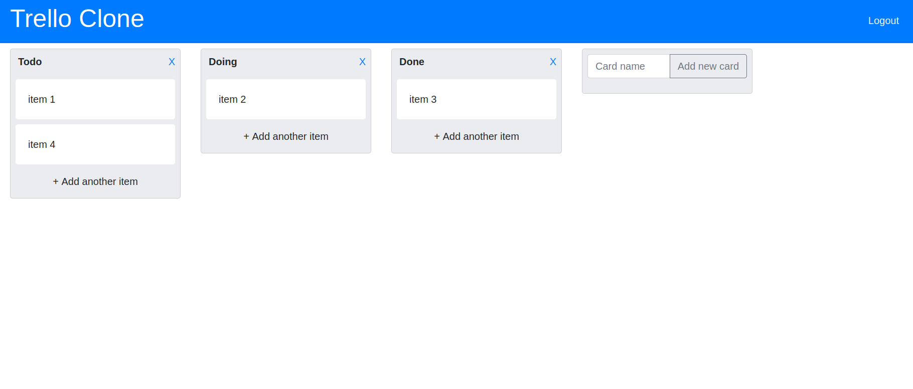

# Trello Clone



Trello clone made with the intent of practising backend skills as well as the creation of [hypermedia-driven apps](https://htmx.org/essays/hypermedia-driven-applications/).

Live Demo: http://luanbrt18.pythonanywhere.com/

# Technologies

Project is created with

- Python
- Html
- Css
- Django
- Htmx
- Bootstrap
- Docker
- MySql

# To do

- Add item details page
- Add more trello features to the app

# Requirements 

In order to run this application, you need to have the following installed:

- [docker](https://docs.docker.com/get-docker/)
- [docker compose](https://docs.docker.com/compose/install/)

# Running

To run the app, simply execute

```
docker-compose up
```

Then access the ui on localhost:8000
